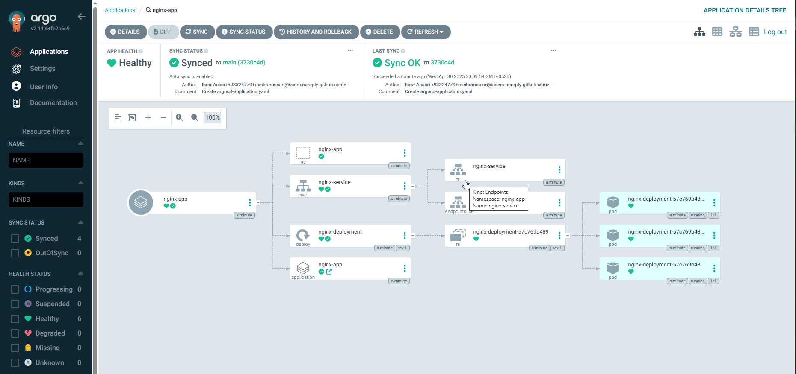

## Gitops with Argo


### Instructions to Use:

**Verify Deployment**:
   - Check the ArgoCD UI or CLI (`argocd app get nginx-app`) to confirm the application is synced and healthy.
   - Verify the Nginx pods and service:
     ```bash
     kubectl get pods -n nginx-app
     kubectl get svc -n nginx-app
     ```

**Test the Application**:
   - Port-forward the service to access the Nginx welcome page:
     ```bash
     kubectl port-forward svc/nginx-service -n nginx-app 8080:80
     ```
   - Open `http://localhost:8080` in a browser to see the Nginx default page.

**Practice GitOps**:
   - Update the `replicas` field in `deployment.yaml` (e.g., change to 3) and push to the Git repository.
   - ArgoCD will detect the change and automatically sync the deployment to match the new replica count.

This setup provides a minimal Nginx application managed by ArgoCD, demonstrating GitOps principles where the desired state is defined in Git, and ArgoCD ensures the cluster state matches it.
